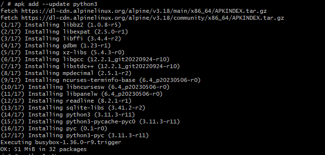
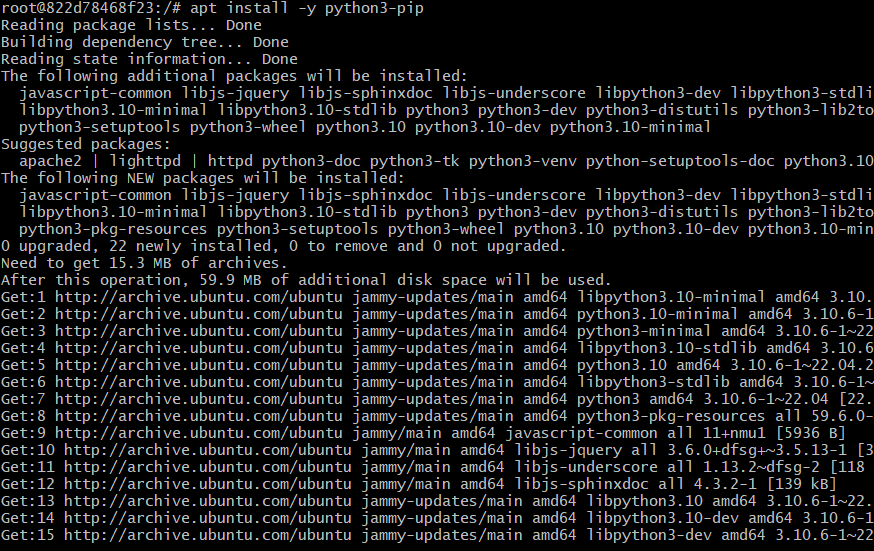

Docker Day 4 topics
-----------------------

### 1.	Create an alpine container in interactive mode and install python

* run the Alpine container in interactive mode with /bin/sh as `docker container run -it -P alpine /bin/sh`

* update & upgrade apk as below

```
apk update
apk upgrade --available
```

* install python3 using apk `apk add --update python3`



* check the python version 


### 2.	Create a ubuntu container with sleep 1d and then login using exec and install python

* deploy docker container for ubuntu

* connect to the container using exec command & install python from [Ref](https://www.digitalocean.com/community/tutorials/how-to-install-python-3-and-set-up-a-programming-environment-on-an-ubuntu-20-04-server)

* following the steps, below is the output while installation



* when checking the python3 version 


### Postgres sql db:

* command to deploy container `docker container run -it -e POSTGRES_PASSWORD=trekking -e POSTGRES_USER=panoramic -e POSTGRES_DB=employees postgres`
* once deployed, in iteractive mode, `psql -h  172.17.0.2 employees panoramic` 
