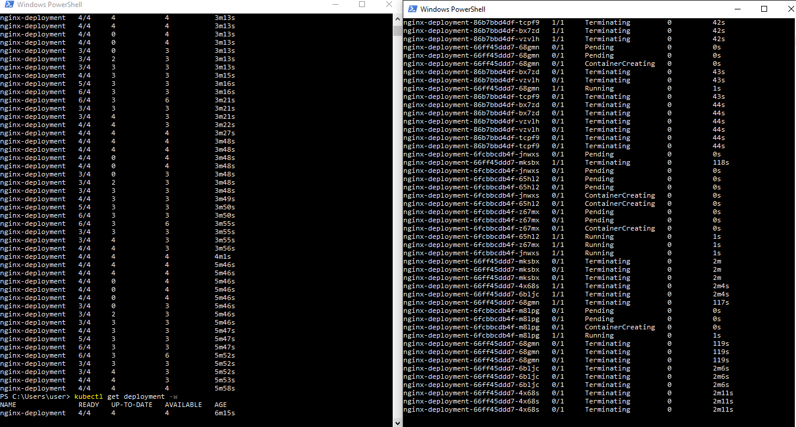
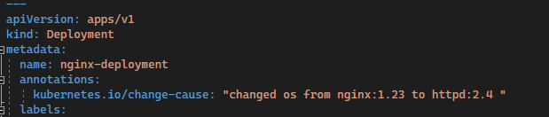
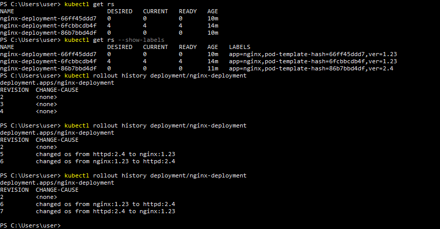

L8s cont:
-----------------

### Deployments:

* write a service and Deployment manifest:
[yaml-file](/K8s/YAML/Deployment/nginx-deployment.yaml)

#### Annotations:
* added annotations to Deployment:
[yaml-file](/K8s/YAML/Deployment/nginx-deployment.yaml)

#### Rollback commands:
*  refer here for command to roll back: [Ref](https://kubernetes.io/docs/concepts/workloads/controllers/deployment/#rolling-back-to-a-previous-revision)

