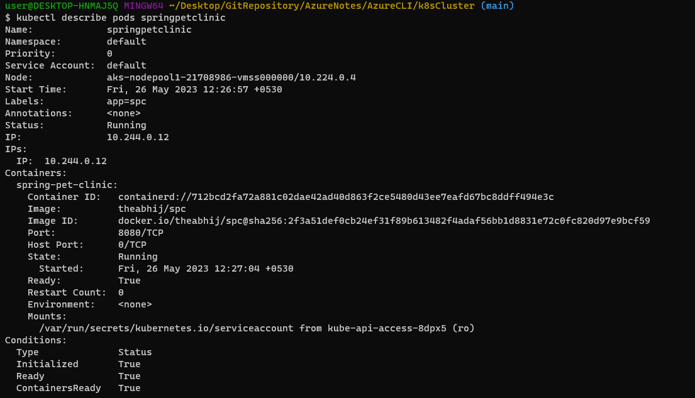
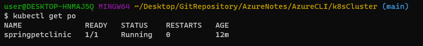
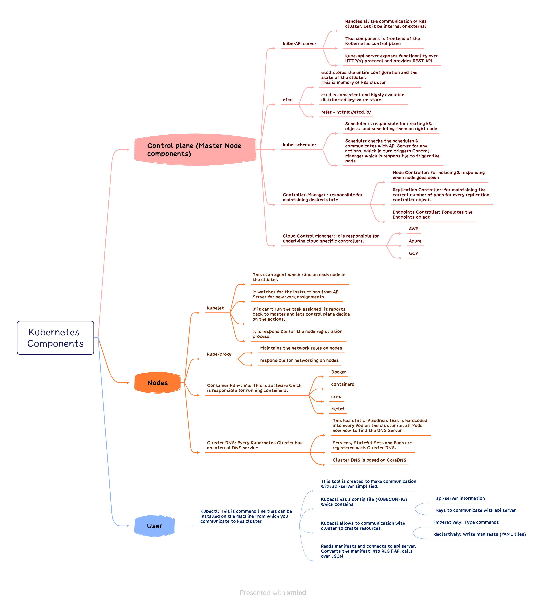
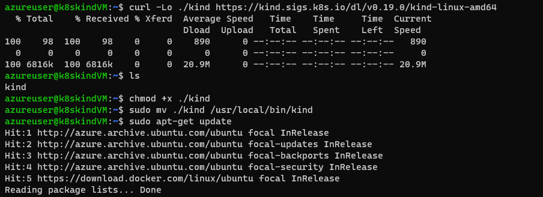
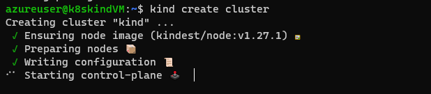
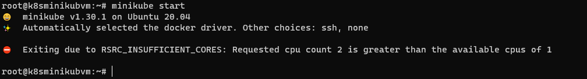
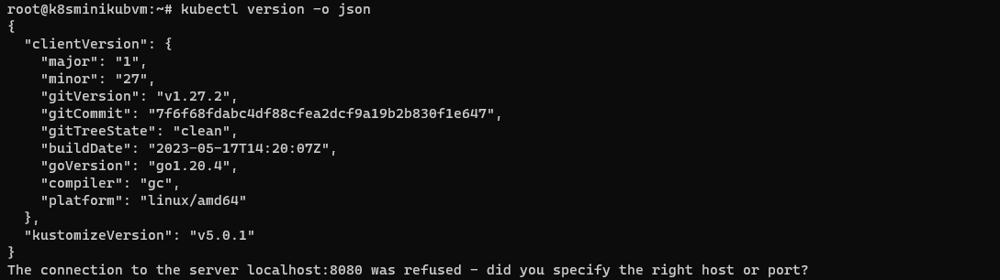
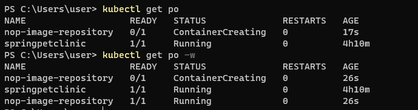
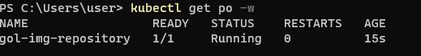

JOIP Tasks
------------------

Day 1
------

#### 1.	Have the installation of Kubernetes (K8S) cluster by using kubeadm?

* install using below steps:

* [Ref](./K8sInstallation.md)

#### 2.	Write a Pod Spec for Spring Pet Clinic and nopCommerce Applications

[YAML](./PracticeYAMLFiles/Pods/spc.yaml)

#### 3.	Execute the kubectl commands: kubectl get pods and describe po

Day 2
-------

#### 1. Explain Kubernetes architecture?

#### 2. Setup k8s on single node using minikube and kind?

* [Ref](https://kind.sigs.k8s.io/docs/user/quick-start/#installation) for official doc on installing Kind in Linux.

* Deploying cluster in kind

#### 3. Run the Spring Pet Clinic application by k8s manisfest file?
 

[YAML](./PracticeYAMLFiles/Pods/spc.yaml)

Day 3
------

#### 1.	 K8s Cluster Installation: minikub

* [Ref](https://vegastack.com/tutorials/how-to-install-kubernetes-with-minikube-on-ubuntu-20-04-lts/) for steps to install minikube

 

#### 2.	Writing the Manifest Files for Spring PetClinic and nopCommerce App

* SPC - [YAML](./PracticeYAMLFiles/Pods/spc.yaml)

* NOP - [YAML](./PracticeYAMLFiles/Pods/nop.yaml)

#### 3.	Writing the Manifest Files for Game of Life App

* GOL - [YAML](./PracticeYAMLFiles/Pods/gol.yaml)

