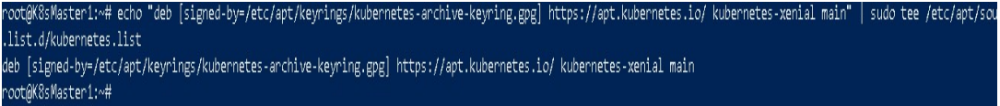

Kubernets installaton Steps :
-----------------------------------

### Install Docker in all VMs:

* Install docker on all 3 VMs


`curl -fsSL https://get.docker.com -o get-docker.sh`


`sh get-docker.sh`

* Add users to Docker group (default users for AWS - ubuntu/Azure -
azureuser)

`sudo usermod -aG docker azureuser` OR `sudo usermod -aG docker ubuntu`

* Turn off swap

`sudo swapoff -a`

* Exit and re-login


### Install Go lang in all 3 VMs **as root user**

* Run these commands to switch to root user (in all 3 VMs)

`sudo -i`

* once we are root user, run below commands:

`wget https://storage.googleapis.com/golang/getgo/installer_linux`

`chmod +x ./installer_linux`

`./installer_linux`

`source /root/.bash_profile`


#### Installing cri-dockerd ( **all nodes as root** )

`git clone https://github.com/Mirantis/cri-dockerd.git`

`cd cri-dockerd`

`mkdir bin`

`go build -o bin/cri-dockerd`


`mkdir -p /usr/local/bin`

`install -o root -g root -m 0755 bin/cri-dockerd /usr/local/bin/cri-dockerd`

`cp -a packaging/systemd/* /etc/systemd/system`

`sed -i -e 's,/usr/bin/cri-dockerd,/usr/local/bin/cri-dockerd,' /etc/systemd/system/cri-docker.service`

`systemctl daemon-reload`

`systemctl enable cri-docker.service`

`systemctl enable --now cri-docker.socket`


### Installing kubeadm, kubelet and kubectl ( **all nodes as root** )

`cd ~`

`sudo apt-get update`

`sudo apt-get install -y apt-transport-https ca-certificates curl`

* get apt-key for K8s installation from google cloud OR K8s downloads location

`sudo curl -fsSLo /etc/apt/keyrings/kubernetes-archive-keyring.gpg https://packages.cloud.google.com/apt/doc/apt-key.gpg`

### OR

`sudo curl -fsSLo /etc/apt/keyrings/kubernetes-archive-keyring.gpg https://dl.k8s.io/apt/doc/apt-key.gpg`


* write details for apt K8s package download into **apt sources location**


`echo "deb [signed-by=/etc/apt/keyrings/kubernetes-archivekeyring.gpg] https://apt.kubernetes.io/ kubernetes-xenial main" | sudo tee /etc/apt/sources.list.d/kubernetes.list`



`apt-get update`


`sudo apt-get install -y kubelet kubeadm kubectl`


`sudo apt-mark hold kubelet kubeadm kubectl`


### Run the next commands as root only in **Master {master-node}** node to setup cri-socket (**as root**) 

`kubeadm init --pod-network-cidr "10.244.0.0/16" --cri-socket "unix:///var/run/cri-dockerd.sock"`


### Copy "kubeadmin join <>" command along with the **specific TOKEN** from the output of above command in  other **Worker Nodes** to join Master Node.
### we can find it at the end of the STDOUT of above command.
**


### After executing the above command you will get the following steps mkdir,sudo sp,sudo chown run them as a regular user

* Your Kubernetes control-plane has initialized successfully!

* To start using your cluster, you need to run the following as a regular user:

`exit`

`mkdir -p $HOME/.kube`

`sudo cp -i /etc/kubernetes/admin.conf $HOME/.kube/config`

`sudo chown $(id -u):$(id -g) $HOME/.kube/config`


*  Alternatively, if you are the root user, you can run:

`export KUBECONFIG=/etc/kubernetes/admin.conf`

### Install Flannel to start ( **only master node** )

`kubectl apply -f https://github.com/flannel-io/flannel/releases/latest/download/kube-flannel.yml`


### Check whether your node (**master-node**) is running or not

`kubectl get nodes -w`

* ( -w for watch, watches any changes )


### **KUBEADM is installed on the MASTER NODE Successfully !!**

### Go to Worker-node 01 and 02 and execute

`su - root`

`export KUBECONFIG=/etc/kubernetes/admin.conf`

```
kubeadm join 10.0.0.4:6443 --token pozx3l.mh39vjz1rnc7rc1t --cri-socket "unix:///var/run/cri-dockerd.sock" --discovery-token-ca-cert-hash sha256:04ddbd0439b039f8b189c9cb1334bf8a46a0856a5dcf9247b006900a994fddd6
```


### Go to your Master Node & run below command to check if the **Node** is visible in the list.

`kubelet get pods -w`

### **Our NODE1 is in READY state !!!**


