K8s practice
-------------
### Replica Sets

##### Replica Set example 1 - 

[Yaml-file](/K8s/YAML/ReplicaSets/jenkins-alpine-rs.yaml)
* output is 

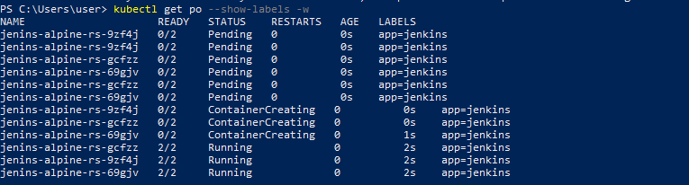 


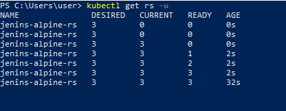

##### Replica sets with reduced pods count from 3 to 2
* output is 

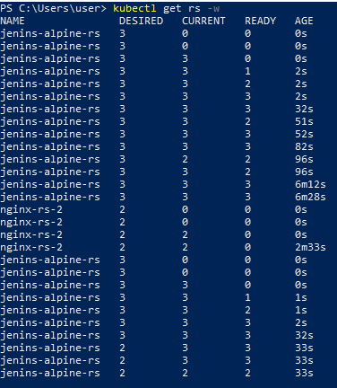 

##### Replica Set example 2 - 
[Yaml-file](/K8s/YAML/ReplicaSets/alpine-rs2.yaml)
* output is 

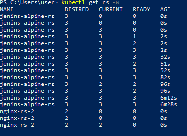


### Services for Cluster IP (internal traffic)

* Create Replica set for nginx & deploy
[yaml-file](/K8s/YAML/Services/nginx-rs.yaml)

* Create Pod for alpine & deploy
[yaml-file](/K8s/YAML/Services/alpine-os.yaml)

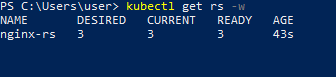

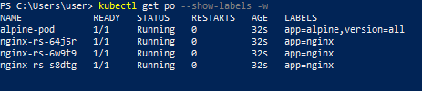 

* Create Service for Replica set of nginx & deploy
[yaml-file](/K8s/YAML/Services/nginx-svc.yaml)

* service is running with an IP address - 

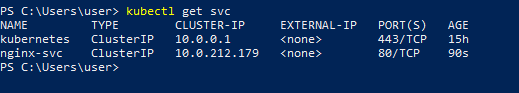

* now login to alpine pod using below command
```
kubectl exec -it alpine-pod -- /bin/sh
```

* after installing curl in alpine with apk, 
	* try pinging the svc ip address, it will fail

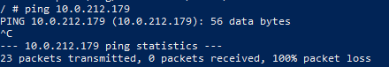

* now try to get the html file using 

```
curl http://<svc-ip-add>
```

* We will get the HTML file back from one of the nginx pods in RS

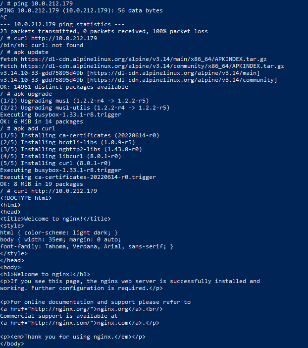

* now try curl using the svc name

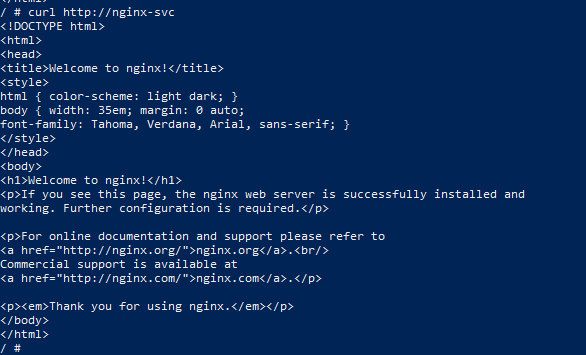


### Service for Outside Traffic

[Ref Here](https://kubernetes.io/docs/concepts/services-networking/service/#publishing-services-service-types)

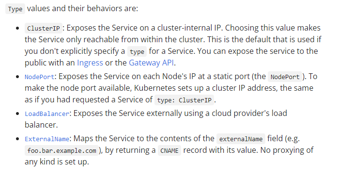


### Persistant Volumes:


