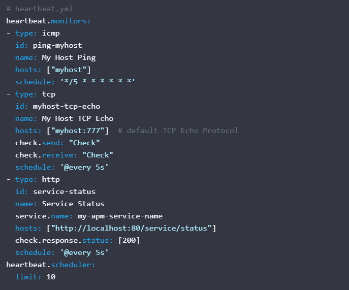
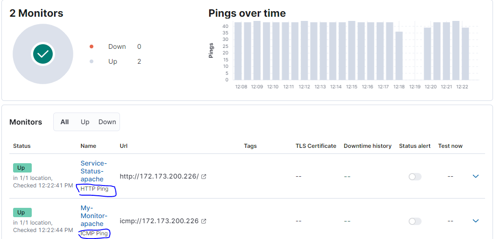
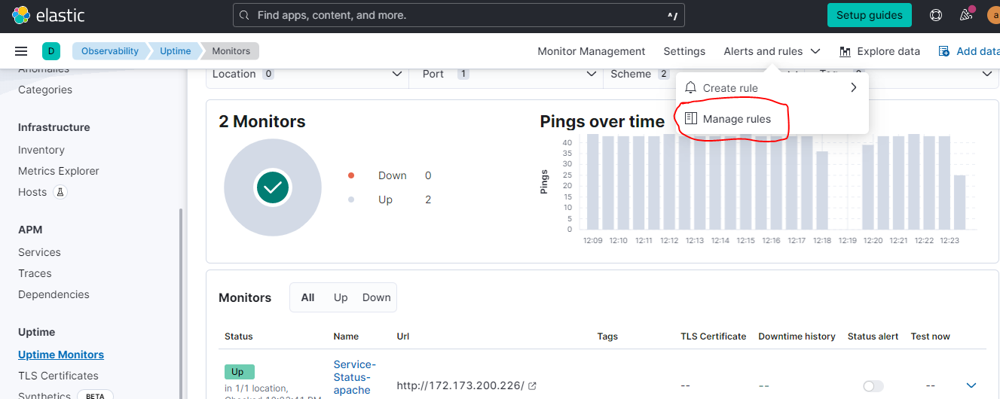
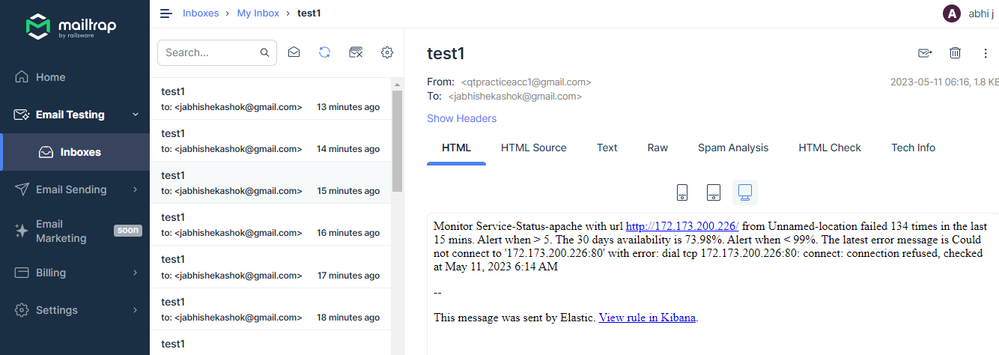

Elastic Search
----------------

### Install heartbeat in monitoring VM:
Official page:
[ref](https://www.elastic.co/guide/en/beats/heartbeat/current/heartbeat-installation-configuration.html)

* installing in Ubuntu using apt installer:
* [ref](https://www.elastic.co/guide/en/beats/heartbeat/current/setup-repositories.html#_apt)

#### below are the commands to enter for installaion:
* these steps are only for ubuntu using apt
```
wget -qO - https://artifacts.elastic.co/GPG-KEY-elasticsearch | sudo apt-key add -
sudo apt-get install apt-transport-https
echo "deb https://artifacts.elastic.co/packages/8.x/apt stable main" | sudo tee -a /etc/apt/sources.list.d/elastic-8.x.list
sudo apt-get update && sudo apt-get install heartbeat-elastic
sudo systemctl enable heartbeat-elastic

```
### Configuration:
* All the elastic stack is generally installed and configuration files are stored in similar directories
    * config location: /etc/<prod-name>
    * install location: /usr/share/<prod-name>


#### edit the file `/etc/heartbeat/heartbeat.yml` to add cloud id & auth
* Monitor types available : [ref](https://www.elastic.co/guide/en/beats/heartbeat/current/configuration-heartbeat-options.html)


#### add which type of monitoring we want to the config file:
* refer here for official docs for format
[official-docs](https://www.elastic.co/guide/en/beats/heartbeat/current/configuration-heartbeat-options.html)



* I have added ICMP & HTTP monitoring to heartbeat config file:


* start the service for Heartbeat `sudo service heartbeat-elastic start`


* Now monitor the Kibana portal "Uptime Monitors" tab for updates.




* Open "Alerts & Rules" drop down & seelct "Manage rules" to configure emailing configurations.



[Refer Here](./htmlFiles/monitor1-Rules-Alerts-Observability-Elastic.html)

* we will find the monitoring updates in "MailTrap" 



* Now try stopping Apache service in first VM & monitor the reactions in Kibana dashboard & Mail trap notifications.

* Try restarting the services `systemctl start apache2` & monitor the same.


K8s Cont:
-------------

### Daemon Sets
* Manifest for Daemon sets for "fluentd" image of Debian flavour,

[YAML-File](/K8s/YAML/DeamonSets/Fluentd-DS.yaml)

* to check rollout history `kubectl rollout history ds/fluentd`

### Node Pool:
* Update the Node Pool using following AZ command 

`az aks nodepool update --resource-group KubeCTLRG --cluster-name KubeAKSCluster --name nodepool1 --labels dept=ACCT purpose=testing --no-wait`

* here I have given the nodepool label as "purpose=testing", hence only pods having Nodeselector: "purpose=testing" will get deployed on this node.

[YAML File](/K8s/YAML/NodSelectors/jenkins.yaml)

AZ AKS Command : [AZ File](/K8s/YAML/NodSelectors/nodepool-edit.txt)

